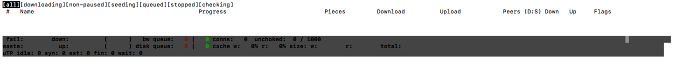
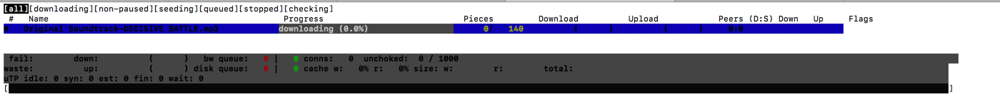
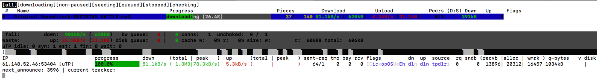

# bytetorrent-plus

[bytetorrent-plus](https://github.com/bytetorrent-plus/bytetorrent-plus) is a new generation of bittorrent applications that are built on the [bytetrade blockchain](https://www.bytetrade.io/) and and [libtorrent](https://github.com/arvidn/libtorrent).
 It works on iOS, Android, OS X, Windows and Linux Server.

### Background
P2P download based on BitTorrent Protocol was once one of the most important applications on the Internet. But in the past practice, there are two problems that are difficult to solve：

1. Copyright Infringement: the creator of the content cannot get paid
2. Leecher: most nodes only want to download and do not want to upload

The ByteTorrent Protocol records all behaviors on the ByteTrade Content Blockchain and quantifies the upload and download of each Peer via the Proof of Transfer mechanism. The downloader pays the token, and the Publisher and Seeder of the content receives the token, which is an important upgrade to the BitTorrent Protocol.

### Creating and Publishing Torrents
About Torrent, you can read the metainfo files section of this [article](http://bittorrent.org/beps/bep_0003.html).

It's worth noting that the Torrent on the ByteTorrent blockchain does not need to specify Tracker information, it will use ByteTrade DHT Tracker.
Unlike BitTorrent, after making Torrent, you need to post Torrent's info_hash to the ByteTrade chain to prove that you are the author of this content. At the same time you need to specify:

1. Creator:  User name of the content creator on the ByteTrade network
2. Amount:  The copyright fee that downloaders need to pay to download this content. In order to facilitate calculation, Amount needs to be a multiple of Piece.
3. Percent:  It is the percentage of the publisher’s share of the copyright fee paid by downloaders. It's an integer between 0-10000, the default is 8000. We recommend using this value. It means that after a downloader downloads a video, he can earn back the cost of downloading the video by uploading another 5 copies, so this video is equivalent to be free for him.

Now, Torrents can be created and submitted via the Windows Client. The Windows Client does not support submitting a copyright-free content. If you have special situations, you can contact our customer support for instructions.\
Please note that before submitting the info_hash, you need to make sure you are the copyright owner of the content. The ByteTorrent Foundation does not assume any responsibility for a series of issues arising from copyright.

### Downloading Torrents and Sharing Files
The downloader needs to deposit a fee to the network before downloading. The amount of deposit will usually be slightly higher than the actual amount to be consumed (some Pieces will be requested multiple times during the transmission). After the settlement period is completed, the user can redeem the remaining of the deposit. Deposit consists of two parts: the copyright fee and the bandwidth fee for the download.\
The bandwidth fee represents the fee payable to the Seeder per 1 GB of data downloaded. Currently, the recommended value is 3BTP/GB

The following are the current mainstream cloud service providers and the cost of uploading 1GB of data. (For reference only)  

Cloud Service | Price
------------ | -------------
Google Cloud | $0.12/GB
AWS |  $0.088/GB
Tencent Cloud| $0.037/GB
Vultr| $0.0067/GB
Digital Ocean| $0.0049/GB

In general, the higher the bandwidth fee set by the downloader, the more people will be willing to provide the upload service. Too low bandwidth fee will result in no one willing to transfer data

##### Transfer process:
1. Downloader deposits a fee to the blockchain to get payment_id
2. Downloader obtains Torrent information through Tracker
3. Seeder transmits a Piece to Downloader
4. Downloader verifies the legality of Piece through the signature in Torrent
5. If the verification passes, Downloader provides a Receipt for this Piece to Seeder
6. After the Seeder receives Receipt, Seeder validates the signature. If the validation fails or does not receive Receipt, the Downloader will be blacked out and will no longer be served.
7. After the Downloader’s download is complete, all issued Receipt will be summarized and sent to the blockchain to complete the settlement.

##### Here are some special cases:
1. If Downloader cannot finish the settlement within 172,800 blocks, Seeder can get his own income from the deposit of the Downloader with a receipt.
2. If the Downloader settlement is complete, but the Seeder do not receive the correct payment, then Seeder can submit the Receipts to the blockchain. If there is any remaining unallocated deposit, the blockchain will allocate the deposit to Seeder; if there is no remaining deposit, it will leave the Downloader a Poor review
3. After 1209600 blocks and Downloader has completed settlement, Downloader can redeem the remaining deposit
4. After 1209600 blocks, Seeder can no longer receive any payment by providing the Receipt

### Structure of Receipt
```
torrent_info_hash
payment_id
seeder_bytetrade_id
downloader_bytetrade_id
piece_id
SIGNATURE(...)
```

### Network Fee Rate
The copyright fee and the bandwidth fee will be charged by the witness nodes (network) at the time of settlement to cover the cost of storage and calculation.

The percentage depends on the number of Torrent’s Piece Number:

Piece Number | Network Fee Rate
------------ | -------------
<=256 |  0.5%
<=512 |  1%
<=1024 | 1.5%
<=2048 | 2%
<=4096 | 3%
<=16384 | 4%

The maximum number of Piece is 16384.\
In the Stage 1 phase, we will regularly return 50% of the network fee paid by the registered user to their inviters who invite them to join ByteTorrent.

### Example
Publisher A is going to release a video with a size of 512M and he creates a Torrent. The size of each Piece is 1M, and the number of Piece is 512.\
A set the price at 512 BTP for this video, and his share percentage is 80%.\
User B and User C provide upload services for this video separately.\
User D is invited by User E to register ByteTorrent and is ready to download this video, which pays 4 BTP for each GB transmission.\
User D needs to pledge a total of 768 Piece fees, which can be calculated by the following formula:
```
0.8 * 512 (Copyright fee paid to Torrent Publisher A)
+ 0.2 * 512 (Copyright fee paid to Seeder)
+ 0.00390625 (4/1024 transmission fee per MB) * 768 (network bandwidth fee)
+ 1 * 0.2 * 256 (prepaid fees for Seeder's 256 Piece copyright fees)
= 566.2 BTP
```
Among them, B provides 128 pieces of uploads, and C provides 400 pieces of uploads.
```
Publisher A will get 1 * 0.8 * 512 * 0.99 = 405.504 BTP
Seeder B will get (1 * 0.2 + 0.00390625) *128 * 0.99 = 25.839 BTP
Seeder C will get (1 * 0.2 + 0.00390625) *400 * 0.99 = 80.746875 BTP
Network fee will be: 405.504 + 25.839 + 80.746875 / 0.99 * 0.01 = 5.172625 BTP
Inviter E will get 5.172625 * 50% = 2.5863125 BTP
After 1209600 blocks, Downloader D can redeem 566.2 - 517.2625 = 48.9375 BTP
```

### Others
We strongly recommend the Publisher of Torrent to provide Seeder service for a while until there are enough Seeders.

We temporarily block the upload function from the mobile devices to prevent traffic waste and overheating issues. We will consider removing this restriction based on user feedback.
Tracker cannot return to the list of users being downloaded during Announce, which means that users who are downloading cannot provide upload services to other users at the same time. We will continue to observe the network and consider whether to remove this restriction.

You can use the Windows client to do the same. However, considering the NAT penetration problem, some Windows clients may not be able to do it. You can submit this to the Issues Track and we will try to fix it.

We recommend Seeder renting a cloud server with a public IP address since compared to AWS, Digital Ocean, Vultr, it has significantly lower bandwidth costs.


### Download
##### Android Version
Click to download the [Android client](https://play.google.com/store/apps/details?id=app.bytetorrentplus.com.bytetorrentplus) from Google Play \
If you do not have a bytetrade account, please download bytetrade wallet - [ByteHub Android Client](https://play.google.com/store/apps/details?id=com.bytetrade.bytehub) firstly and register to get your bytetrade account.

##### iOS Version
Will Coming Soon

##### Windows Version
Click to download the [Windows client](https://cdn2.bytetrade.io/bytetorrent/windows/bytetorrent-v.0.1.2-2019-8-28.zip), which provides download and seeding function. You can find the free torrent file of TED conferences on the ByteTorrent website, and start download to experience the product. Please visit the Help Center for [tutorials](https://bytetorrent.zendesk.com/hc/en-us/articles/360034522833-ByteTorrent-Plus-Windows-Tutorial?_blank).

##### Linux(Minner) Version
###### Install Docker
Please refer to this [doc](https://docs.docker.com/install/)

###### Install ByteTorrent-Plus

```
docker pull libtorrent/bytetorrent
docker pull libtorrent/bytetorrent-client
```
You can view result through `docker images`\
You can find [bytetorrent-plus docker image](https://hub.docker.com/r/libtorrent/bytetorrent) on [Docker Hub](https://hub.docker.com/)

###### Start ByteTorrent-Plus
```
sudo docker run -itd --net=host -v $path:/opt/run libtorrent/bytetorrent -f log -s download/
-m torrent/ -i $bytetrade_id -p $priv_key -t http://18.140.32.93:16969/
-u udp://18.140.32.93:12315/ -b http://p4.bytetrade.io:8080/
```
Parameter    |  Explanation
------------ | -----------
$path | the docker working path, which requires manual configuration
-i |  bytetrade account id
-p  | bytetrade account id's private key in hex format, like `ebb4d7fc86dcdffe427a303f2a21b864aa03d0cd59905e67140d15d3baec7ba`
-s   | the file download path, and there will be a hidden directory named as “resume” under the download directory, recording the summary of the Torrents
-m   |  torrent directory, the program will periodically scan the path, and when the torrent is loaded, the program will delete the Torrent in torrent directory
-P     |  server listening port, default is 7654. If multiple servers are started on one machine, it is necessary to manually specify the port\
-t,-u,-b  |  just use the values in the example


Other parameters
```
usage: server [OPTIONS]
OPTIONS:
  -P <port>             server listen port for client [ defalut is 7654 ]
  -i <bytetrade id>     bytetrade id
  -p <priv key>         priv key in hex format
  -t <torrent_server_url>  torrent_server_url
  -u <track_udp_url>       track_udp_url
  -b <bytetrade_server_url>       bytetrade_server_url
  -f <log file>         logs all events to the given file
  -s <path>             sets the save path for downloads. This also determines
                        the resume data save directory. Torrents from the resume
                        directory are automatically added to the session on
                        startup.
  -m <path>             sets the .torrent monitor directory. torrent files
                        dropped in the directory are added the session and the
                        resume data directory, and removed from the monitor dir.
  -r <seconds>          sets the scan interval of the monitor dir
  -F <milliseconds>     sets the UI refresh rate. This is the number of
                        milliseconds between screen refreshes.

  -T <limit>            sets the max number of connections per torrent
  -U <rate>             sets per-torrent upload rate
  -D <rate>             sets per-torrent download rate
  -G                    enable seed_mode[default is false]
  -Q                    enable share_mode[default is false]
  -a <mode>             sets the allocation mode. [sparse|allocate]
  -d                    open debug log

```

######  View running status.
```
ID=$(sudo docker run -itd --net=host libtorrent/bytetorrent-client 127.0.0.1 7654)
sudo docker attach $ID
```
At this time, you will see the status as Fig.1. 

*Fig.1 shows that the server is working properly, but there are no download and upload tasks yet.*

###### How to download
Make sure there is enough money in the account to copy the torrents to the torrent directory.
 
*Fig.2 shows that fee is being paid.*


*Fig.3 shows that payment is successful, ready to download.*

 
*Fig.4 shows the download progress, press `i` and `Enter` to see which nodes to download from.*

###### How to upload
1. Copy the files to the save path directory in order, and then copy the Torrent to the torrent directory.
2. When viewed with client, it will enter the file checking status and then the seeding status.
3. Press `i` and `Enter` to see the peer information that has been connected and downloaded from.

###### How to delete task
* Method 1: Restart\
  Shut down program\
  Delete the infohash folder corresponding to `download/.resume`\
  Restart program

* Method 2: Use Client\
  Connect to server through client, select task by pressing `up` and `down` keys, and then enter `D`.


### Where To Get Help
* [Explorer](https://explorer.bytetrade.com/)
* [Telegram](https://t.me/bytetorrentplus)
* [Issues Tracker](https://github.com/bytetorrent-plus/bytetorrent-plus/issues)
